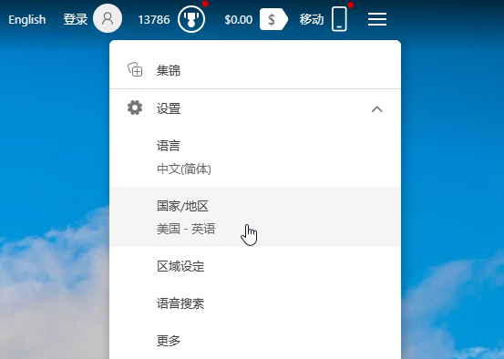

# 锁定Bing区域以使用Copilot

能够使用Bing Copilot的必要条件：

- 网络位于Bing提供服务的国家/地区（中国大陆不可以）
- Bing网站设置中的国家/地区可提供服务


## 合适的网络环境

首先，需要提供一个干净的网络环境，一般香港、日本、美国等ip都是可以的

## 锁定Bing区域



首先，确认你访问的是[www.bing.com](https://www.bing.com)而不是[cn.bing.com](https://cn.bing.com)的中国特供版

然后，只要在bing.com的网站设置中，将`国家/地区`设置到可提供服务的区域就可以

但是，可能是由于ip变更、浏览器语言设置、系统语言设置等因素，这个设置经常在一段时间后又自己跳到中国

所以我们可以用传入参数的方式确保打开的页面`国家/地区`始终在可提供服务的区域：

- `setmkt`用于设置`国家/地区`，必须在可提供服务的区域
- `setlang`用于设置`界面显示语言`，不影响Copilot的使用

下面分别是`国家/地区`设置为美国、香港，`界面显示语言`设置为中文简体的例子：

```
https://global.bing.com/?setmkt=en-us&setlang=zh-cn
https://global.bing.com/?setmkt=zh-hk&setlang=zh-cn
```

**从地址栏访问这个地址，就可以打开支持Copilot的Bing了，建议把这个地址添加到收藏夹，以后都从收藏夹打开Bing**

## 修改默认修改引擎

如果你使用Bing作为浏览器的默认搜索引擎，使用默认的配置也会导致国家/地区跳回中国

你可以在浏览器设置中**把下述链接设置为Bing的搜索引擎链接**，这样每次进行搜索时都会重新固定Bing区域

```
https://global.bing.com/search?q=%s&setmkt=en-us&setlang=zh-cn
https://global.bing.com/search?q=%s&setmkt=zh-hk&setlang=zh-cn
```

