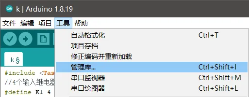
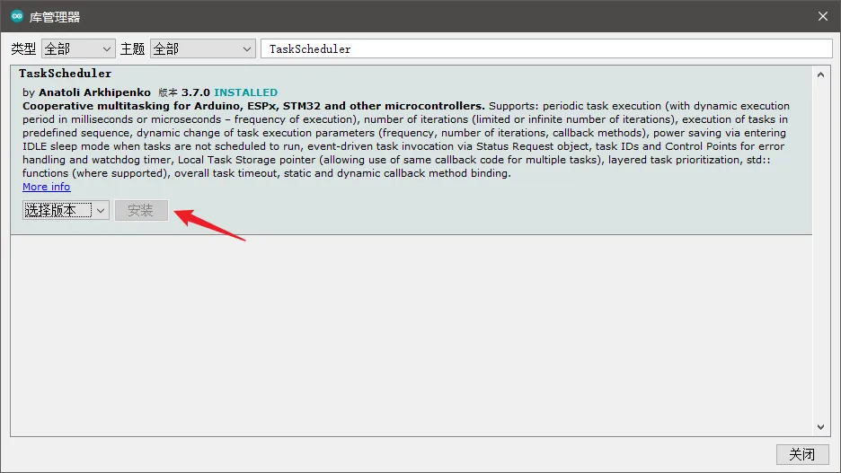

# Arduino TaskScheduler - Arduino 多任务调度器的安装与使用实例

## 问题缘由

Arduino 程序一般是顺序执行的，虽然内置了如 `millis()`、`micros()`、`delay()`、`delayMicroseconds()` 这样的时间函数，但要么依赖于不断的循环，要么对整个程序造成阻塞，无法完成真正的多任务并行处理。

**[TaskScheduler](https://github.com/arkhipenko/TaskScheduler)** 是一个为 Arduino 提供任务调度支持的第三方库，借助这个它可以实现复杂的多任务调度，本文做一个最简单的 Example

------

## TaskScheduler 的安装

- 点击 Arduino IDE 菜单栏中的 `工具` - `管理库...` 打开库管理工具

  

- 搜索 `TaskScheduler`，并安装

  

------

## TaskScheduler 的使用

- 需引用、定义、声明的内容：

```cpp
//include 头文件
#include <TaskScheduler.h>
//声明回调函数
void task_1();
void task_2();
//声明计划任务
//TASK_ONCE 执行一次；TASK_FOREVER 永不停止
Task t1(3000, TASK_FOREVER, &task_1);  //循环周期3000ms，永不停止，回调task_1
Task t2(1000, 20, &task_2);  //循环周期1000ms，循环20次，回调task_2
//调度器声明
Scheduler Sch;

//回调函数定义
void task_1()
{
  Serial.print("Task 1\n");
}
void task_2()
{
  Serial.print("Task 2\n");
}
```

- 需写在 `void setup()` 中的内容：

```cpp
void setup() {
  //调度器初始化
  Sch.init();
  //添加任务
  Sch.addTask(t1);
  Sch.addTask(t2);
}
```

- 需写在 `void loop()` 中的内容：

```cpp
void loop() {
  //执行调度器
  Sch.execute();
}
```

- 控制任务的方法
  - 需要自动定期执行的，可写在 `void setup()` 中
  - 需要用其他函数控制的，则写在需要的地方

```cpp
//使任务生效（开始运行）
t1.enable();
//使任务失效（停止运行）
//注意：disable任务并不会重置循环次数
t1.disable();
```

