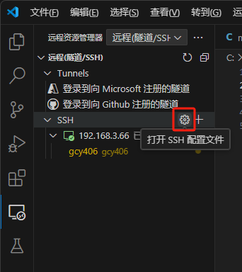

# 树莓派4B相关setup

## 🧰实用工具

### ▶️局域网扫IP

Advanced IP Scanner

### ▶️sd卡备份

Win32DiskImager

  

## 💽烧录镜像

> [!info]  
>  
> [https://www.raspberrypi.com/software/](https://www.raspberrypi.com/software/)  

  

## ☁️换源（中科大）

> [!info] Raspbian 源使用帮助 — USTC Mirror Help 文档  
> [https://mirrors.ustc.edu.cn/help/raspbian.html](https://mirrors.ustc.edu.cn/help/raspbian.html)  

> [!info] Raspberrypi 源使用帮助 — USTC Mirror Help 文档  
> [https://mirrors.ustc.edu.cn/help/raspberrypi.html](https://mirrors.ustc.edu.cn/help/raspberrypi.html)  

```Shell
sudo sed -i 's|deb.debian.org|mirrors.ustc.edu.cn|g' /etc/apt/sources.list
sudo sed -i 's|archive.raspberrypi.com|mirrors.ustc.edu.cn/raspberrypi|g' /etc/apt/sources.list.d/raspi.list
```

```Shell
sudo apt update
sudo apt upgrade
```

  

## 🖥️安装xrdp用win远程桌面连接

```Shell
sudo apt install xrdp
```

  

## 📶WiFi设置

```Shell
sudo nano /etc/wpa_supplicant/wpa_supplicant.conf


# 添加下面的内容
country=CN

network={
    ssid="WiFiSSID"
    psk="passwd"
}
```

  

## ⚙️System设置

可以设置语言时区等

（在此处又设置了WIFI）

```Shell
sudo raspi-config
```

  

## 🌐ip固定

> [!info] 树莓派配置静态ip的几种方式（dhcpcd和Network-Manager）_树莓派固定ip-CSDN博客  
> [https://blog.csdn.net/m0_47673868/article/details/132410559](https://blog.csdn.net/m0_47673868/article/details/132410559)  

```Shell
# 查看连接
nmcli c

# 修改固定ip
sudo nmcli c mod "有线连接 1" ipv4.method manual ipv4.addresses 192.168.3.66/24
sudo nmcli c mod "WiFiSSID" ipv4.method manual ipv4.addresses 192.168.3.45/24
# 恢复自动获取
sudo nmcli c mod "有线连接 1" ipv4.method auto
sudo nmcli c mod "WiFiSSID" ipv4.method auto

# 修改默认网关
sudo nmcli c mod "有线连接 1" ipv4.method manual ipv4.gateway 192.168.3.1
sudo nmcli c mod "WiFiSSID" ipv4.method manual ipv4.gateway 192.168.3.1
```

  

## 🔌如何正确关机

```Shell
sudo shutdown -h now
```

  

## 🧑🏻‍💻连接VSCode

### 1️⃣安装插件

**VSCode 安装插件 Remote Development**

> 此时可以通过密码连接（可以先连接一次）

  

### 2️⃣生成密钥对

Windows下cmd执行：

```Shell
ssh-keygen
```

生成密钥对后，将公钥上传到树莓派

```Shell
cd ~
mkdir .ssh
cd .ssh
nano authorized_keys
# 粘贴公钥内容
chmod 700 ~/.ssh
chmod 600 ~/.ssh/authorized_keys
```

  

### 3️⃣配置VSCode

点击左侧”远程资源管理器“，修改SSH配置文件



```Shell
Host 192.168.3.66
    HostName 406pi
    User gcy406
    IdentityFile C:\Users\Otto\.ssh\pi
```

  

### 4️⃣连接

刷新列表后出现添加的配置，点击连接


## 📖RS485 HAT 文档

> [!info] RS485 CAN HAT (B) - Waveshare Wiki  
> RS485 CAN HAT (B) 是微雪电子为树莓派开发的一款的带 RS485 和 CAN 通信功能的扩展板，具备 RS485、CAN 通信功能。  
> [https://www.waveshare.net/wiki/RS485_CAN_HAT_(B)](https://www.waveshare.net/wiki/RS485_CAN_HAT_(B))

