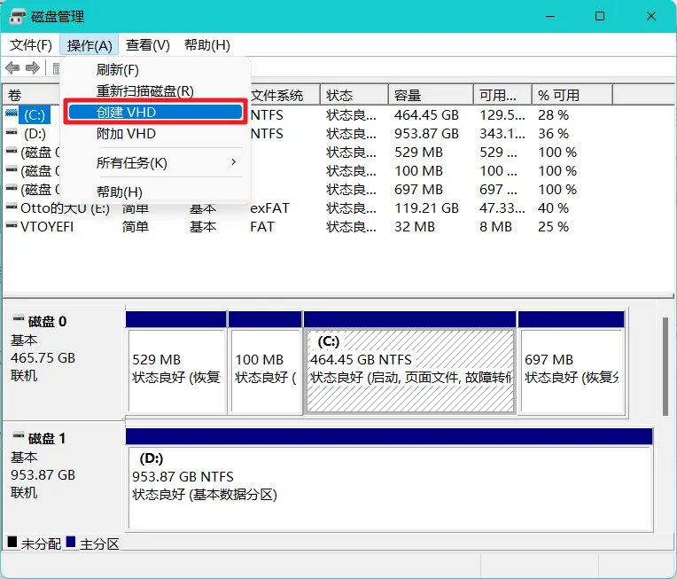
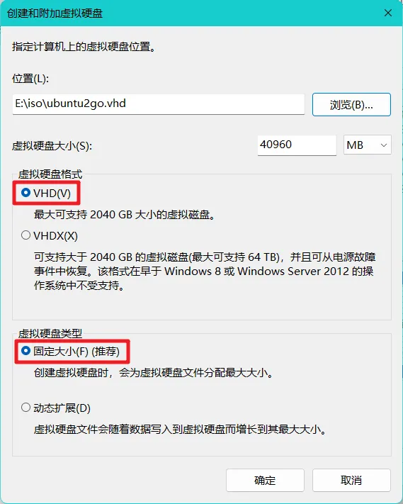
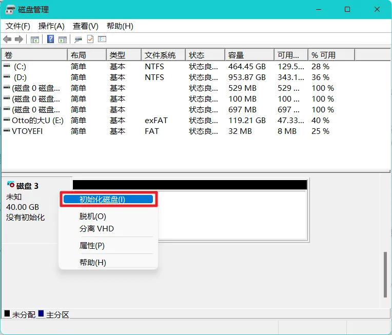
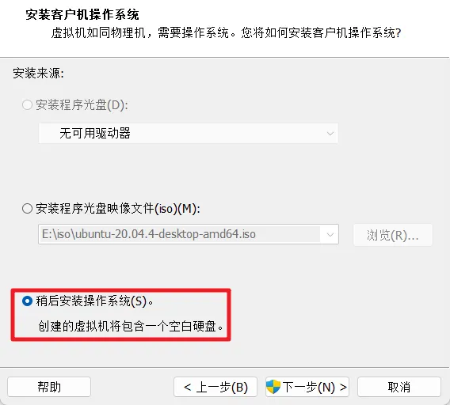
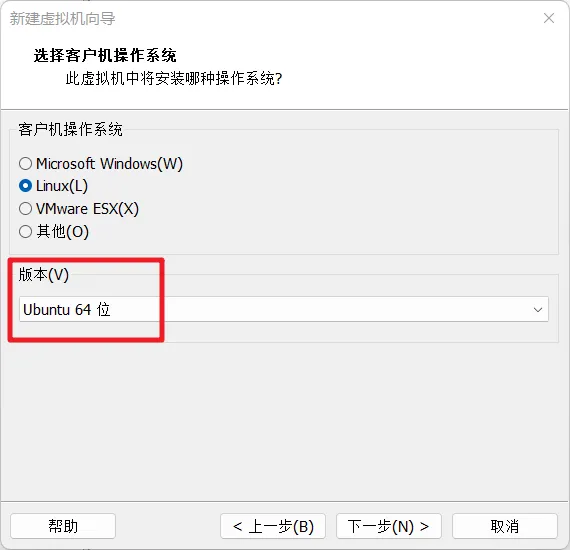
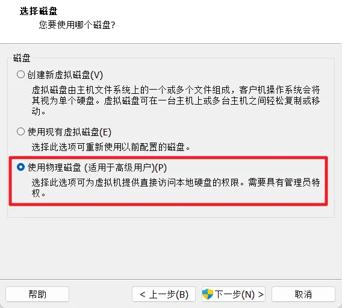
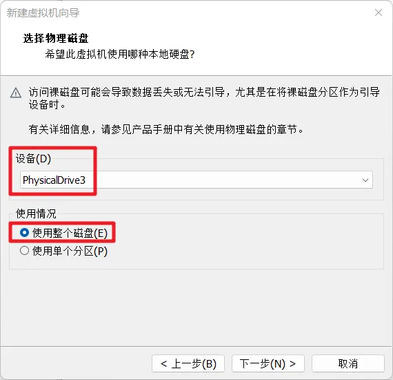
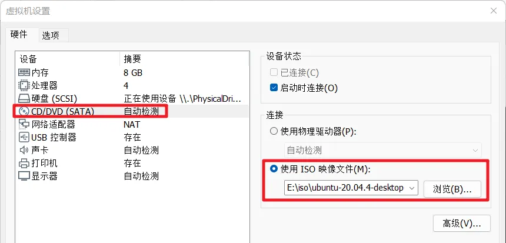
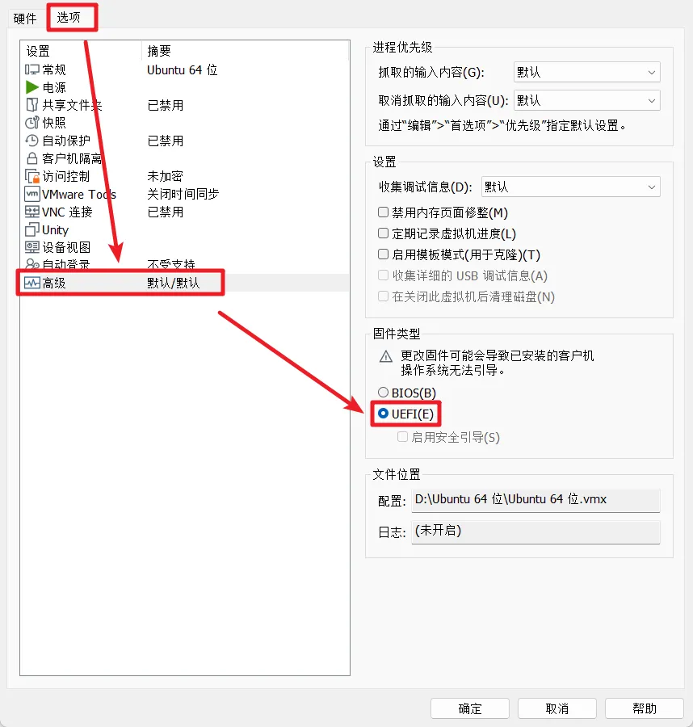

# 基于 Ventoy 实现 Ubuntu To Go

## 场景需求

我的专业学习需要用到 **Ubuntu** + ROS，实验室、宿舍、工控机等**多台电脑设备**上都需要相同的环境，而该**环境搭建相对比较复杂**，单是装系统＋安装 ROS 至少也要一个小时的时间，更不用说实际开发项目也需要在不同设备间迁移

再者，在安装有 Windows 系统的电脑上增装 Ubuntu 双系统，会**破坏原有硬盘分区结构**，安装维护也较为复杂

因而参考 WinToGo，萌生制作一个 `UbuntuToGo`，一劳永逸地解决上述痛点

不过传统 XToGo 思路往往会**占用整个 U 盘或需要对 U 盘进行重分区**，对 U 盘原本的功能有所破坏，**可迁移性也比较差**

因此考虑将整个 Ubuntu 系统安装在虚拟磁盘中，再借助 `Ventoy 项目`进行引导


## 概述

U 盘/存储介质选择

> 由于需要将完整的操作系统放入 U 盘中引导启动，故对 U 盘的 4K 读写性能要求非常高，普通的 2.0、3.0、3.1 U 盘都无法胜任，只能选择**固态 U 盘**或直接使用**固态硬盘 + 硬盘盒**

本文方案基于

> Windows 11 21H2（涉及 vhd 虚拟磁盘的创建）
> 
> Ventoy 1.0.80（涉及 UbuntuToGo 引导工作）
> 
> VMware Pro 15.0.0（涉及 Ubuntu 安装流程）
> 
> Ubuntu 20.04（涉及 Ubuntu 安装流程）

本文主要参考

> https://www.ventoy.net/cn/plugin_vtoyboot.html
> 
> https://blog.csdn.net/m0_59839672/article/details/119352772

本方案缺点

> 基于 vtoyboot 仅支持 vhd 固定大小虚拟磁盘


## 1️⃣ Ventoy 的安装

打开 [Ventoy 官网](https://www.ventoy.net/cn/download.html)，下载 [ventoy-1.0.80-windows.zip](https://github.com/ventoy/Ventoy/releases)

解压后打开 `Ventoy2Disk.exe`，设备选择 U 盘，点击安装即可

> 此过程会清空 U 盘，注意备份


## 2️⃣ vhd 虚拟磁盘的创建

右键 Window 徽标，打开`磁盘管理`，选择`创建VHD`



在创建虚拟磁盘时，

- 建议**直接将位置选择到 U 盘**中
  
- 硬盘大小根据自己情况设置，一般建议 20g+，这里设置了 40g
  
- 虚拟硬盘格式**必须**选择 `VHD`、`固定大小`
  



创建成功后，

- 右键创建的磁盘，选择`初始化磁盘`
- 分区形式选择 `GPT`
- 记下磁盘编号，比如这里是`磁盘 3`，等会要用




## 3️⃣ 安装 Ubuntu 系统到 vhd 虚拟磁盘

准备：

- 下载 Ubuntu 安装镜像 [ubuntu-20.04.5-desktop-amd64.iso](https://mirrors.tuna.tsinghua.edu.cn/ubuntu-releases/20.04/ubuntu-20.04.5-desktop-amd64.iso)

### 1.创建虚拟机

打开 Vmware 新建虚拟机，选择`自定义(高级)`，除以下步骤外，默认或根据自己情况设置即可

- 稍后安装操作系统
  
  
  
- 操作系统 - Linux - Ubuntu64 位
  
  
  
- 使用物理磁盘（适用于高级用户）
  
  
  
- 设备选择步骤2️⃣中创建的磁盘编号（如磁盘 3 则选择 PhysicalDrive3），使用整个磁盘
  
  
  
- 创建完成后点击`编辑虚拟机设置`
  
  - 将 CD/DVD 选择为`使用 ISO 映像文件`，并选择准备的 `Ubuntu 20.04 安装映像`
    
    
    
  - 移除打印机（避免不必要的bug）
    
  - 在`选项` - `高级`中选择`UEFI`
    
    
    

### 2.安装 Ubuntu

启动创建的虚拟机，根据提示安装系统即可

> - 如果看不到“继续”按键，可按住 Windows 徽标键向上拖动窗口空白处
> - 建议选择最小安装，并禁止在安装中下载，在安装过程中，如果出现下载，则不断点击 Skip

### 3.安装 vtoyboot 脚本

虚拟机创建完成后，重启虚拟机进入 Ubuntu

> 根据 toyboot 的官方教程，应安装 grub，可输入命令安装
> 
> ```bash
> sudo apt install grub2
> ```
> 
> 这样可以同时支持 UEFI 和 Legacy BIOS 启动，但我没有 Legacy BIOS 设备，所以没有测试这种安装方法的有效性

在 Ubuntu 中打开浏览器，[下载 vtoyboot 脚本](https://github.com/ventoy/vtoyboot/releases)（.iso文件）

根据提示挂载映像，然后将映像中的压缩包复制到主目录下，解压，然后执行命令

```bash
sudo bash vtoyboot.sh
```

至此 Ubuntu 的安装结束，可关闭虚拟机


## 4️⃣ 更改后缀名

关闭虚拟机后，再次打开`磁盘管理`，右键虚拟磁盘选择`分离 VHD`

然后将`.vhd`文件重命名，改后缀名为 `.vtoy`。推荐保留原来的后缀名，同时增加一个 .vtoy 后缀。例如`ubuntu20.04.vhd.vtoy`

> 如果创建虚拟磁盘时没有将位置选择到 U 盘中，则确保将此文件复制到 U 盘中


## 5️⃣ 引导进入 UbuntuToGo

关闭计算机，然后开机，迅速按下快速启动快捷键，然后选择从 U 盘启动（或进入 BIOS，设置启动顺序）

> 各品牌快速启动快捷键
> 
> | 主板品牌 | 启动按键 | 笔记本品牌 | 启动按键 | 台式机品牌 | 启动按键 |
> | --- | --- | --- | --- | --- | --- |
> | 华硕主板 | F8  | 联想笔记本 | F12 | 联想台式机 | F12 |
> | 技嘉主板 | F12 | 宏基笔记本 | F12 | 惠普台式机 | F12 |
> | 微星主板 | F11 | 华硕笔记本 | ESC | 宏基台式机 | F12 |
> | 映泰主板 | F9  | 惠普笔记本 | F9  | 戴尔台式机 | ESC |
> | 梅捷主板 | ESC或F12 | 联想Thinkpad | F12 | 神舟台式机 | F12 |
> | 七彩虹主板 | ESC或F11 | 戴尔笔记本 | F12 | 华硕台式机 | F8  |
> | 华擎主板 | F11 | 神舟笔记本 | F12 | 方正台式机 | F12 |
> | 斯巴达克主板 | ESC | 东芝笔记本 | F12 | 清华同方台式机 | F12 |
> | 昂达主板 | F11 | 三星笔记本 | F12 | 海尔台式机 | F12 |
> | 双敏主板 | ESC | IBM笔记本 | F12 | 明基台式机 | F8  |
> | 翔升主板 | F10 | 富士通笔记本 | F12 |     |     |
> | 精英主板 | ESC或F11 | 海尔笔记本 | F12 |     |     |
> | 冠盟主板 | F11或F12 | 方正笔记本 | F12 |     |     |
> | 富士康主板 | ESC或F12 | 清华同方笔记本 | F12 |     |     |
> | 顶星主板 | F11或F12 | 微星笔记本 | F11 |     |     |
> | 铭瑄主板 | ESC | 明基笔记本 | F9  |     |     |
> | 盈通主板 | F8  | 技嘉笔记本 | F12 |     |     |
> | 捷波主板 | ESC | Gateway笔记本 | F12 |     |     |
> | Intel主板 | F12 | eMachines笔记本 | F12 |     |     |
> | 杰微主板 | ESC或F8 | 索尼笔记本 | ESC |     |     |
> | 致铭主板 | F12 | 苹果笔记本 | 长按"option"键 |     |     |
> | 磐英主板 | ESC |     |     |     |     |
> | 磐正主板 | ESC |     |     |     |     |
> | 冠铭主板 | F9  |     |     |     |     |

启动进入 Ventoy 引导菜单，选择 UbuntuToGo 回车进入即可


## 硬盘扩容方法

1. 将 `.vtoy` 文件后缀改回 `.vhd`

2. 打开 powershell（win+run输入powershell），输入命令：

   ```shell
   # 运行diskpart
   diskpart
   # 加载vhd镜像
   Select vdisk file=<pathToVHD>
   # 查看vhd信息
   detail vdisk
   # 扩展vhd空间（单位为MB）
   # 此过程可能需要花费较长时间
   expand vdisk maximum=<sizeInMegaBytes>
   # 退出diskpart
   exit
   ```

3. 右键 Windows 徽标打开**磁盘管理**，选择 `操作` - `附加VHD`，选择已扩容的VHD文件

4. 打开 VMware

   - 若之前的虚拟机还没删除，则直接**修改虚拟机配置**，把硬盘删了（如果还有 CD/DVD 的话也删了），**重新添加硬盘**，和之前的操作一样选择**使用物理磁盘**，此时应该能够自动识别修改后的容量

   - 若之前的虚拟机已经删除，就按照3️⃣的方法**重新创建一个虚拟机**，和之前的操作一样选择**使用物理磁盘，**此时应该能够自动识别修改后的容量，之后不需要添加 CD/DVD

5. 在 VMware 中启动虚拟机，进入 Ubuntu，**用自带的磁盘管理软件扩容主分区**即可

   - 如果没有自带的磁盘管理软件，可通过 `sudo apt install gparted` 安装一个

6. 关闭虚拟机，在 Windows 磁盘管理中右键虚拟磁盘选择 `分离 VHD`，然后将**后缀名改回** `.vtoy`