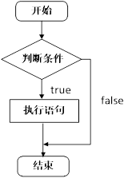
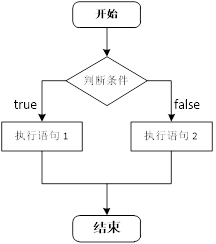
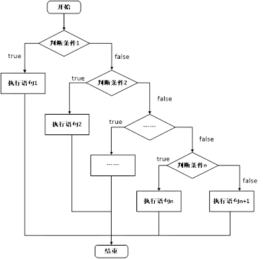
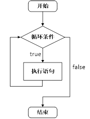
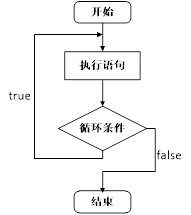

# C++ Learning Note - 基础篇

> 本文为[黑马程序员C++教程从0到1入门编程视频教程](https://www.bilibili.com/video/BV1et411b73Z)的学习笔记
>
> 并参考其讲义（评论区有下载）

## 1. HelloWorld - 基础知识

### 1.1 注释

**作用**：在代码中加一些说明和解释，方便自己或其他程序员程序员阅读代码

**两种格式**

1. **单行注释**：`// 描述信息` 
   - 通常放在一行代码的上方，或者一条语句的末尾，对该行代码说明
2. **多行注释**： `/* 描述信息 */`
   - 通常放在一段代码的上方，对该段代码做整体说明

> 提示：编译器在编译代码时，会忽略注释的内容

### 1.2 变量

**作用**：给一段指定的内存空间起名，方便操作这段内存

**语法**：`数据类型 变量名 = 初始值;`

> 注意：C++在创建变量时，必须给变量一个初始值，否则会报错

### 1.3  常量

**作用**：用于记录程序中不可更改的数据

C++定义常量两种方式

1. **\#define** 宏常量： `#define 常量名 常量值`
   * 通常在文件上方定义，表示一个常量


2. **const**修饰的变量 `const 数据类型 常量名 = 常量值`
   * 通常在变量定义前加关键字const，修饰该变量为常量，不可修改

### 1.4 关键字

**作用**：关键字是C++中预先保留的单词（标识符）

* **在定义变量或者常量时候，不要用关键字**

C++关键字如下：

| asm        | do           | if               | return      | typedef  |
| ---------- | ------------ | ---------------- | ----------- | -------- |
| auto       | double       | inline           | short       | typeid   |
| bool       | dynamic_cast | int              | signed      | typename |
| break      | else         | long             | sizeof      | union    |
| case       | enum         | mutable          | static      | unsigned |
| catch      | explicit     | namespace        | static_cast | using    |
| char       | export       | new              | struct      | virtual  |
| class      | extern       | operator         | switch      | void     |
| const      | false        | private          | template    | volatile |
| const_cast | float        | protected        | this        | wchar_t  |
| continue   | for          | public           | throw       | while    |
| default    | friend       | register         | true        |          |
| delete     | goto         | reinterpret_cast | try         |          |

>  提示：在给变量或者常量起名称时候，不要用C++得关键字，否则会产生歧义。

### 1.6 标识符命名规则

**作用**：C++规定给标识符（变量、常量）命名时，有一套自己的规则

* 标识符不能是关键字
* 标识符只能由字母、数字、下划线组成
* 第一个字符必须为字母或下划线
* 标识符中字母区分大小写

> 建议：给标识符命名时，争取做到见名知意的效果，方便自己和他人的阅读

### 1.7 一把梭式代码演练

```cpp
#include<iostream>
#define pi 3.1415926
using namespace std;

int main() {

    /*变量定义*/
    int a = 1;
    //int int = 1; //关键字不能作为变量名
    //int 1a = 1; //变量名不能以数字开头
	cout << "int a = " << a << endl;

    /*常量定义（宏常量、const修饰常量）*/
    cout << "#define pi = " << pi << endl;
    const int con_a = 666;
    cout << "const int chou = " << con_a << endl;
    //con_a = 6; //常量不可更改

	return 0;
}
```


## 2. int - 数据类型

C++规定在创建一个变量或者常量时，必须要指定出相应的数据类型，否则无法给变量分配内存

### 2.1 整型

**作用**：整型变量表示的是整数类型的数据

C++中能够表示整型的类型有以下几种方式，**区别在于所占内存空间不同**：

| **数据类型**        | **占用空间**                                    | 取值范围         |
| ------------------- | ----------------------------------------------- | ---------------- |
| short(短整型)       | 2字节                                           | (-2^15 ~ 2^15-1) |
| int(整型)           | 4字节                                           | (-2^31 ~ 2^31-1) |
| long(长整形)        | Windows为4字节，Linux为4字节(32位)，8字节(64位) | (-2^31 ~ 2^31-1) |
| long long(长长整形) | 8字节                                           | (-2^63 ~ 2^63-1) |

### 2.2 sizeof关键字

**作用**：利用sizeof关键字可以统计数据类型所占内存大小

**语法**： `sizeof( 数据类型 / 变量)`

### 2.3 实型（浮点型）

**作用**：用于表示小数

浮点型变量分为两种：

1. 单精度float 
2. 双精度double

两者的**区别**在于表示的有效数字范围不同。

| **数据类型** | **占用空间** | **有效数字范围** |
| ------------ | ------------ | ---------------- |
| float        | 4字节        | 7位有效数字      |
| double       | 8字节        | 15～16位有效数字 |

### 2.4 字符型

**作用**：字符型变量用于显示单个字符

**语法**：`char ch = 'a';`

> 注意1：在显示字符型变量时，用单引号将字符括起来，不要用双引号

> 注意2：单引号内只能有一个字符，不可以是字符串

- C和C++中字符型变量只占用1个字节。
- 字符型变量并不是把字符本身放到内存中存储，而是将对应的ASCII编码放入到存储单元

ASCII码表格：

| **ASCII**值 | **控制字符** | **ASCII**值 | **字符** | **ASCII**值 | **字符** | **ASCII**值 | **字符** |
| ----------- | ------------ | ----------- | -------- | ----------- | -------- | ----------- | -------- |
| 0           | NUT          | 32          | (space)  | 64          | @        | 96          | 、       |
| 1           | SOH          | 33          | !        | 65          | A        | 97          | a        |
| 2           | STX          | 34          | "        | 66          | B        | 98          | b        |
| 3           | ETX          | 35          | #        | 67          | C        | 99          | c        |
| 4           | EOT          | 36          | $        | 68          | D        | 100         | d        |
| 5           | ENQ          | 37          | %        | 69          | E        | 101         | e        |
| 6           | ACK          | 38          | &        | 70          | F        | 102         | f        |
| 7           | BEL          | 39          | ,        | 71          | G        | 103         | g        |
| 8           | BS           | 40          | (        | 72          | H        | 104         | h        |
| 9           | HT           | 41          | )        | 73          | I        | 105         | i        |
| 10          | LF           | 42          | *        | 74          | J        | 106         | j        |
| 11          | VT           | 43          | +        | 75          | K        | 107         | k        |
| 12          | FF           | 44          | ,        | 76          | L        | 108         | l        |
| 13          | CR           | 45          | -        | 77          | M        | 109         | m        |
| 14          | SO           | 46          | .        | 78          | N        | 110         | n        |
| 15          | SI           | 47          | /        | 79          | O        | 111         | o        |
| 16          | DLE          | 48          | 0        | 80          | P        | 112         | p        |
| 17          | DCI          | 49          | 1        | 81          | Q        | 113         | q        |
| 18          | DC2          | 50          | 2        | 82          | R        | 114         | r        |
| 19          | DC3          | 51          | 3        | 83          | S        | 115         | s        |
| 20          | DC4          | 52          | 4        | 84          | T        | 116         | t        |
| 21          | NAK          | 53          | 5        | 85          | U        | 117         | u        |
| 22          | SYN          | 54          | 6        | 86          | V        | 118         | v        |
| 23          | TB           | 55          | 7        | 87          | W        | 119         | w        |
| 24          | CAN          | 56          | 8        | 88          | X        | 120         | x        |
| 25          | EM           | 57          | 9        | 89          | Y        | 121         | y        |
| 26          | SUB          | 58          | :        | 90          | Z        | 122         | z        |
| 27          | ESC          | 59          | ;        | 91          | [        | 123         | {        |
| 28          | FS           | 60          | <        | 92          | /        | 124         | \|       |
| 29          | GS           | 61          | =        | 93          | ]        | 125         | }        |
| 30          | RS           | 62          | >        | 94          | ^        | 126         | `        |
| 31          | US           | 63          | ?        | 95          | _        | 127         | DEL      |

ASCII 码大致由以下**两部分**组成：

* ASCII 非打印控制字符： ASCII 表上的数字 **0-31** 分配给了控制字符，用于控制像打印机等一些外围设备。
* ASCII 打印字符：数字 **32-126** 分配给了能在键盘上找到的字符，当查看或打印文档时就会出现。

### 2.5 转义字符

**作用**：用于表示一些不能显示出来的ASCII字符

现阶段我们常用的转义字符有：` \n  \\  \t`

| **转义字符** | **含义**                                | **ASCII**码值（十进制） |
| ------------ | --------------------------------------- | ----------------------- |
| \a           | 警报                                    | 007                     |
| \b           | 退格(BS) ，将当前位置移到前一列         | 008                     |
| \f           | 换页(FF)，将当前位置移到下页开头        | 012                     |
| **\n**       | **换行(LF) ，将当前位置移到下一行开头** | **010**                 |
| \r           | 回车(CR) ，将当前位置移到本行开头       | 013                     |
| **\t**       | **水平制表(HT)  （跳到下一个TAB位置）** | **009**                 |
| \v           | 垂直制表(VT)                            | 011                     |
| **\\\\**     | **代表一个反斜线字符"\"**               | **092**                 |
| \'           | 代表一个单引号（撇号）字符              | 039                     |
| \"           | 代表一个双引号字符                      | 034                     |
| \?           | 代表一个问号                            | 063                     |
| \0           | 数字0                                   | 000                     |
| \ddd         | 8进制转义字符，d范围0~7                 | 3位8进制                |
| \xhh         | 16进制转义字符，h范围0~9，a~f，A~F      | 3位16进制               |

### 2.6 字符串型

**作用**：用于表示一串字符

**两种风格**

1. **C风格字符串**： `char 变量名[] = "字符串值"`

>  注意：C风格的字符串要用双引号括起来

2. **C++风格字符串**：  `string  变量名 = "字符串值"`

> 注意：C++风格字符串，需要加入头文件#include\<string>

### 2.7 布尔类型 bool

**作用**：布尔数据类型代表真或假的值 

bool类型只有两个值：

* true  --- 真（本质是1）
* false --- 假（本质是0）

**bool类型占1个字节大小**

### 2.8 一把梭式代码演练

```cpp
#include <iostream>
#include <string>
#include <math.h> //宏常量PI，基于<math.h>
#define PI acos(-1) 
using namespace std;

int main()
{
    /*整形 short int long longlong*/
    cout << "【整形 short int long longlong】" << endl;
    short short_a = pow(2,15)-1;
    int int_a = pow(2,31)-1;
    long long_a = pow(2,31)-1;
    long long longlong_a = pow(2,63)-1;
    cout << "short_a = " << short_a << endl;
    cout << "int_a = " << int_a << endl;
    cout << "long_a = " << long_a << endl;
    cout << "longlong_a = " << longlong_a << endl;
    //占用字节数
    cout << "\nsizeof(short_a) = " << sizeof(short_a) << endl;
    cout << "sizeof(int_a) = " << sizeof(int_a) << endl;
    cout << "sizeof(long_a) = " << sizeof(long_a) << endl;
    cout << "sizeof(longlong_a) = " << sizeof(longlong_a) << endl;

    /*浮点型 float double*/
    cout << "\n\n【浮点型 float double】" << endl;
    //cout默认输出6位有效数字
    float fpi = 3.14f;
    double dpi = 3.14;
    float float_pi = PI;
    double double_pi = PI;
    cout.precision(7);  //更改cout输出有效数字
    cout << "float_pi = " << float_pi << endl;
    cout.precision(16);
    cout << "double_pi = " << double_pi << endl;
    cout << "\nsizeof(float_pi) = " << sizeof(float_pi) << endl;
    cout << "sizeof(double_pi) = " << sizeof(double_pi) << endl;
    cout.precision(6);

    /*字符型 char（基于ASCII）*/
    cout << "\n\n【字符型 char】" << endl;
    char char_a = 'a';
    cout << "char_a = " << char_a << endl;
    cout << "\nsizeof(char_a) = " << sizeof(char_a) << endl;
    cout << "int(char_a) = " << int(char_a) << endl;

    /*转义字符\*/
    cout << "\n\n【转义字符】" << endl;
    cout << "> [\\]Hello\\\\Wrold" << endl;
    cout << "Hello\\Wrold" << endl;
    cout << "> [enter]Hello\\nWrold" << endl;
    cout << "Hello\nWrold" << endl;
    cout << "> [tab]Hello\\tWrold" << endl;
    cout << "Hello\tWrold" << endl;
    cout << "> [backspace]Hello\\bWrold" << endl;
    cout << "Hello\bWrold" << endl;
    cout << "> [home]Hello\\rWrold" << endl;
    cout << "Hello\rWrold" << endl;
    cout << "> [v-tab]Hello\\vWrold" << endl;
    cout << "Hello\vWrold" << endl;
    cout << "> [page]Hello\\fWrold" << endl;
    cout << "Hello\fWrold" << endl;
    cout << "> [warning]Hello\\aWrold" << endl;
    cout << "Hello\aWrold" << endl;

    /*字符串型 char[] string*/
    cout << "\n\n【字符串型 char[] string】" << endl;
    char ch_a[] = "Hello World!";
    string str_a = "Hello World!";
    //string基于#include <string>
    cout << "char ch_a[] = " << ch_a << endl;
    cout << "string str_a = " << str_a << endl;

    /*布尔类型 bool*/
    cout << "\n\n【布尔类型 bool】" << endl;
    bool flag = true;
    cout << "bool flag = " << flag << endl;
    cout << "sizeof(flag) = " << sizeof(flag) << endl;
    
    return 0;
}
```


## 3. cin - 读取输入

**作用：用于从键盘获取数据**

**关键字**：`cin`

**语法**： `cin >> 变量 `

### 一把梭式代码演练

```cpp
#include <iostream>
#include <string>
using namespace std;

int main()
{
    //int
    int int_a = 0;
    cout << "\nPlease input int_a:" << endl;
    cin >> int_a;
    cout << "int_a = " << int_a << endl;

    //float
    float float_a = 0.1f;
    cout << "\nPlease input float_a:" << endl;
    cin >> float_a;
    cout << "float_a = " << float_a << endl;

    //char
    char char_a = 'a';
    cout << "\nPlease input char_a:" << endl;
    cin >> char_a;
    cout << "char_a = " << char_a << endl;

    //string
    string str_a = "abc";
    cout << "\nPlease input str_a:" << endl;
    cin >> str_a;
    cout << "str_a = " << str_a << endl;

    //bool
    bool bool_a = true;
    cout << "\nPlease input bool_a:" << endl;
    cin >> bool_a; //非零值都代表true
    cout << "bool_a = " << bool_a << endl;

    return 0;
}
```

## 4. calc - 运算符

### 4.1 算术运算符

**作用**：用于处理四则运算 

算术运算符包括以下符号：

| **运算符** | **术语**   | **示例**    | **结果**  |
| ---------- | ---------- | ----------- | --------- |
| +          | 正号       | +3          | 3         |
| -          | 负号       | -3          | -3        |
| +          | 加         | 10 + 5      | 15        |
| -          | 减         | 10 - 5      | 5         |
| *          | 乘         | 10 * 5      | 50        |
| /          | 除         | 10 / 5      | 2         |
| %          | 取模(取余) | 10 % 3      | 1         |
| ++         | 前置递增   | a=2; b=++a; | a=3; b=3; |
| ++         | 后置递增   | a=2; b=a++; | a=3; b=2; |
| --         | 前置递减   | a=2; b=--a; | a=1; b=1; |
| --         | 后置递减   | a=2; b=a--; | a=1; b=2; |

> 在除法运算中，除数不能为0
>
> 只有整型变量可以进行取模运算
>
> 前置递增先对变量进行++，再计算表达式，后置递增相反

### 4.2 赋值运算符

**作用**：用于将表达式的值赋给变量

赋值运算符包括以下几个符号：

| **运算符** | **术语** | **示例**   | **结果**  |
| ---------- | -------- | ---------- | --------- |
| =          | 赋值     | a=2; b=3;  | a=2; b=3; |
| +=         | 加等于   | a=0; a+=2; | a=2;      |
| -=         | 减等于   | a=5; a-=3; | a=2;      |
| *=         | 乘等于   | a=2; a*=2; | a=4;      |
| /=         | 除等于   | a=4; a/=2; | a=2;      |
| %=         | 模等于   | a=3; a%2;  | a=1;      |

### 4.3 比较运算符

**作用**：用于表达式的比较，并返回一个真值或假值

比较运算符有以下符号：

| **运算符** | **术语** | **示例** | **结果** |
| ---------- | -------- | -------- | -------- |
| ==         | 相等于   | 4 == 3   | 0        |
| !=         | 不等于   | 4 != 3   | 1        |
| <          | 小于     | 4 < 3    | 0        |
| \>         | 大于     | 4 > 3    | 1        |
| <=         | 小于等于 | 4 <= 3   | 0        |
| \>=        | 大于等于 | 4 >= 1   | 1        |

### 4.4 逻辑运算符

**作用**：用于根据表达式的值返回真值或假值

逻辑运算符有以下符号：

| **运算符** | **术语** | **示例** | **结果**                                                 |
| ---------- | -------- | -------- | -------------------------------------------------------- |
| !          | 非       | !a       | 如果a为假，则!a为真；  如果a为真，则!a为假。             |
| &&         | 与       | a && b   | 如果a和b都为真，则结果为真，否则为假。                   |
| \|\|       | 或       | a \|\| b | 如果a和b有一个为真，则结果为真，二者都为假时，结果为假。 |

### 4.5 一把梭式代码演练

```cpp
#include <iostream>
using namespace std;

int main()
{
    cout << "没啥好演练的，自己看文档吧" << endl;
    cout << "下一节中也会用到这些东西" << endl;
    return 0;
}
```

## 5. logic - 程序流程结构

### 5.1 选择结构

#### 5.1.1 if语句

**作用**：执行满足条件的语句

if语句的三种形式

* 单行格式if语句

* 多行格式if语句

* 多条件的if语句

  

1. 单行格式if语句：`if(条件){ 条件满足执行的语句 }`



2. 多行格式if语句：`if(条件){ 条件满足执行的语句 }else{ 条件不满足执行的语句 };`



3. 多条件的if语句：`if(条件1){ 条件1满足执行的语句 }else if(条件2){条件2满足执行的语句}... else{ 都不满足执行的语句}`




**嵌套if语句**：在if语句中，可以嵌套使用if语句，达到更精确的条件判断

> 注意：if条件表达式后不要加分号


#### 5.1.2 三目运算符

**作用**： 通过三目运算符实现简单的判断

**语法**：`表达式1 ? 表达式2 ：表达式3`

**解释**：

如果表达式1的值为真，执行表达式2，并返回表达式2的结果；

如果表达式1的值为假，执行表达式3，并返回表达式3的结果。

>  总结：和if语句比较，三目运算符优点是短小整洁，缺点是如果用嵌套，结构不清晰

#### 5.1.3 switch语句

**作用**：执行多条件分支语句

**语法**：

```cpp
switch(表达式)

{

	case 结果1：执行语句;break;

	case 结果2：执行语句;break;

	...

	default:执行语句;break;

}

```

> 注意1：switch语句中表达式类型只能是整型或者字符型

> 注意2：case里如果没有break，那么程序会一直向下执行

> 总结：与if语句比，对于多条件判断时，switch的结构清晰，执行效率高，缺点是switch不可以判断区间


### 5.2 循环结构

#### 5.2.1 while循环语句

**作用**：满足循环条件，执行循环语句

**语法**：` while(循环条件){ 循环语句 }`

**解释**：只要循环条件的结果为真，就执行循环语句



> 注意：在执行循环语句时候，程序必须提供跳出循环的出口，否则出现死循环

#### 5.2.2 do...while循环语句

**作用**： 满足循环条件，执行循环语句

**语法**： `do{ 循环语句 } while(循环条件);`

**注意**：与while的区别在于do...while会先执行一次循环语句，再判断循环条件



> 总结：与while循环区别在于，do...while先执行一次循环语句，再判断循环条件

#### 5.2.3 for循环语句

**作用**： 满足循环条件，执行循环语句

**语法**：` for(起始表达式;条件表达式;末尾循环体) { 循环语句; }`

> 注意：for循环中的表达式，要用分号进行分隔

> 总结：while , do...while, for都是开发中常用的循环语句，for循环结构比较清晰，比较常用

#### 5.2.4 嵌套循环

**作用**： 在循环体中再嵌套一层循环，解决一些实际问题


### 5.3 跳转语句

#### 5.3.1 break语句

**作用:** 用于跳出选择结构或者循环结构

break使用的时机：

* 出现在switch条件语句中，作用是终止case并跳出switch
* 出现在循环语句中，作用是跳出当前的循环语句
* 出现在嵌套循环中，跳出最近的内层循环语句

#### 5.3.2 continue语句

**作用**：在循环语句中，跳过本次循环中余下尚未执行的语句，继续执行下一次循环

> 注意：continue并没有使整个循环终止，而break会跳出循环

#### 5.3.3 goto语句

**作用**：可以无条件跳转语句

**语法**： `标记:`  `goto 标记;`

**解释**：如果标记的名称存在，执行到goto语句时，会跳转到标记的位置

> 注意：在程序中不建议使用goto语句，以免造成程序流程混乱

### 5.4 一把梭式代码演练

```cpp
#include <iostream>
using namespace std;

int main()
{
    //if语句 & goto
    cout << "[if语句 & goto]下面进行3个整数比大小游戏!" << endl;
    int int_a = 0, int_b = 0, int_c = 0, max = 0, mid = 0, min = 0;
    FLAG:
    cout << "Please input int_a:" << endl;
    cin >> int_a;
    cout << "Please input int_b:" << endl;
    cin >> int_b;
    cout << "Please input int_c:" << endl;
    cin >> int_c;
    if (int_a == int_b || int_a == int_c || int_b == int_c){
        cout << "All three numbers should be different! \n" << endl;
        goto FLAG;
    }
    if (int_a > int_b && int_a > int_c){
        if (int_b > int_c){
            max = int_a;  mid = int_b;  min = int_c;
        }
        else{
            max = int_a;  mid = int_c;  min = int_b;
        }
    }else if (int_b > int_a && int_b > int_c){
        if (int_a > int_c){
            max = int_b;  mid = int_a;  min = int_c;
        }
        else{
            max = int_b;  mid = int_c;  min = int_a;
        }
    }else{
        if (int_a > int_b){
            max = int_c;  mid = int_a;  min = int_b;
        }
        else{
            max = int_c;  mid = int_b;  min = int_a;
        }
    }
    cout << "The Result is:" << endl;
    cout << max << " > " << mid << " > " << min << endl;

    //三目运算符 & switch
    cout << "\n[三目运算符 & switch]下面进行2个小数比大小游戏!" << endl;
    float float_a = 0, float_b = 0;
    cout << "Please input float_a:" << endl;
    cin >> float_a;
    cout << "Please input float_b:" << endl;
    cin >> float_b;
    float float_bigger, float_smaller;
    float_bigger = float_a > float_b ?  float_a : float_b;
    float_smaller = float_a < float_b ?  float_a : float_b;
    cout << "The Result is:" << endl;
    switch (float_bigger == float_smaller)
    {
    case 1:
        cout << float_bigger << " = " << float_smaller << endl;
        break;
    case 0:
        cout << float_bigger << " > " << float_smaller << endl;
        break;
    }

    //while循环语句
    //生成一个 0~100 的随机数
    int num = rand() % 100 + 1;
    cout << "\n[while循环语句]下面进行猜数字小游戏！\n" << endl;
    //判断标志
    bool flag = 0;
    //用户输入猜的数字
    int input = 0;
    while(flag == 0){
    cout << "Please input Your Guess Number (0~100):" << endl;
    cin >> input;
    if(input == num){
        flag = 1;
    }else if(input > num){
        cout << "Too Big!\n" << endl;
    }else{
        cout << "Too Small!\n" << endl;
    }
    }
    cout << "\nCongratulations!" << endl;

    //for循环
    cout << "\n[for循环]下面进行画星星展示！" << endl;
    int count = 10;
    for (size_t i = 0; i < count; i++)
    {
        for (size_t j = 0; j <= i; j++)
        {
            cout << "*";
        }
        cout << endl;
    }
    
    return 0;
}
```


## 6. matrix - 数组

### 6.1  一维数组

#### 6.1.1 一维数组的定义

一维数组定义的三种方式：

1. ` 数据类型  数组名[ 数组长度 ]; `
2. `数据类型  数组名[ 数组长度 ] = { 值1，值2 ...};`
3. `数据类型  数组名[ ] = { 值1，值2 ...};`

#### 6.1.2 一维数组的数组名

一维数组名称的**用途**：

1. 可以统计整个数组在内存中的长度
2. 可以获取数组在内存中的首地址

#### 6.1.3 冒泡排序

最常用的排序算法，对数组内元素进行排序

1. 比较相邻的元素。如果第一个比第二个大，就交换他们两个。
2. 对每一对相邻元素做同样的工作，执行完毕后，找到第一个最大值。
3. 重复以上的步骤，每次比较次数-1，直到不需要比较

```cpp
#include <iostream>
using namespace std;

int main()
{
    cout << "下面进行10个数字冒泡排序！\n" << endl;
    int arr[10];
    //请用户键入10个数字
    for (size_t i = 0; i < 10; i++)
    {
        cout << "Please input the num_" << i + 1 << ": " << endl;
        cin >> arr[i];
    }
    
    //冒泡排序
	for (int i = 0; i < 9; i++)
	{
		for (int j = 0; j < 9 - i; j++)
		{
			if (arr[j] > arr[j + 1])
			{
				int temp = arr[j];
				arr[j] = arr[j + 1];
				arr[j + 1] = temp;
			}
		}
	}

    //输出排序
	cout << "\nThe Result is: " << endl;
	for (int i = 0; i < 9; i++)
	{
		cout << arr[i] << " < ";
	}
	cout << arr[9] << endl;
    
	return 0;
}
```

### 6.2 二维数组

#### 6.2.1 二维数组的定义

二维数组定义的四种方式：

1. ` 数据类型  数组名[ 行数 ][ 列数 ]; `
2. `数据类型  数组名[ 行数 ][ 列数 ] = { {数据1，数据2 } ，{数据3，数据4 } };`
3. `数据类型  数组名[ 行数 ][ 列数 ] = { 数据1，数据2，数据3，数据4};`
4. ` 数据类型  数组名[  ][ 列数 ] = { 数据1，数据2，数据3，数据4};`

#### 6.2.2 二维数组的数组名

* 查看二维数组所占内存空间
* 获取二维数组首地址

### 6.3 一把梭式代码演练

```cpp
#include <iostream>
using namespace std;

void mprint(int **array, int im, int jm);

int main()
{
    /*一维数组*/

    //一维数组的定义 - 1
    int arr_1[10];
    for (size_t i = 0; i < 10; i++){
        arr_1[i] = i;
    }
    for (size_t i = 0; i < 10; i++){
        cout << "arr_1[" << i << "] = " << arr_1[i] << endl;
    }
    cout << "\n" << endl;

    //一维数组的定义 - 2
    int arr_2[10] = {1, 2, 3, 4, 5};      //未定义的数会用0填充
    for (size_t i = 0; i < 10; i++){
        cout << "arr_2[" << i << "] = " << arr_2[i] << endl;
    }
    cout << "\n" << endl;

    //一维数组的定义 - 3
    int arr_3[] = {1, 2, 3, 4, 5};
    for (size_t i = 0; i < 10; i++){
        cout << "arr_3[" << i << "] = " << arr_3[i] << endl;    //超出数组范围的索引将按照内存实际值输出
    }

    //一维数组名用途
    //1、可以获取整个数组占用内存空间大小
    int arr_n1[10] = { 1,2,3,4,5,6,7,8,9,10 };
    cout << "\nint arr_n1[10] = { 1,2,3,4,5,6,7,8,9,10 };" << endl;

    cout << "\n整个数组所占内存空间为： " << sizeof(arr_n1) << endl;
    cout << "每个元素所占内存空间为： " << sizeof(arr_n1[0]) << endl;
    cout << "数组的元素个数为： " << sizeof(arr_n1) / sizeof(arr_n1[0]) << endl;

    //2、可以通过数组名获取到数组首地址
    cout << "\n数组首地址为： " << arr_n1 << endl;
    cout << "数组中第一个元素地址为： " << &arr_n1[0] << endl;
    cout << "数组中第二个元素地址为： " << &arr_n1[1] << endl;

    /*二维数组*/

    //二维数组的定义 - 1
    int arr_3_2[3][2];
    arr_3_2[0][0] = 1;
    arr_3_2[0][1] = 2;
    arr_3_2[1][0] = 3;
    arr_3_2[1][1] = 4;
    arr_3_2[2][0] = 5;
    arr_3_2[2][1] = 6;
    cout << endl;
    mprint((int**)arr_3_2, 3, 2);

    //二维数组的定义 - 2
    int arr_5_4[5][4] =
    {
        {1,2,3,4},
        {5,6,7,8},
        {9,10,11,12},
        {13,14,15,16},
        {17,18,19,20}
    };
    cout << endl;
    mprint((int**)arr_5_4, 5, 4);

    //二维数组的定义 - 3
    //数据类型 数组名[行数][列数] = { 数据1，数据2 ,数据3，数据4 };
    int arr3[2][3] = { 1,2,3,4,5,6 };
    cout << endl;
    mprint((int**)arr3, 2, 3);

    //二维数组的定义 - 4
    //数据类型 数组名[][列数] = { 数据1，数据2 ,数据3，数据4 };
    int arr4[][2] = { 6,6,6,6,6,6 };
    cout << endl;
    mprint((int**)arr4, 3, 2);

    //二维数组的定义 - rand_test
    int arr_7_8[7][8];
    for (size_t i = 0; i < 7; i++)
    {
        for (size_t j = 0; j < 8; j++)
        {
            arr_7_8[i][j] = rand();
        }

    }
    cout << endl;
    mprint((int**)arr_7_8, 7, 8);

    //二维数组名用途
    int arr_n2[2][3] =
    {
        {1,2,3},
        {4,5,6}
    };
    cout << "\nint arr_n2[2][3] = " << endl;
    mprint((int**)arr_n2, 2, 3);
    //数组大小
    cout << "\n二维数组大小： " << sizeof(arr_n2) << endl;
    cout << "二维数组一行大小： " << sizeof(arr_n2[0]) << endl;
    cout << "二维数组元素大小： " << sizeof(arr_n2[0][0]) << endl;
    //行列数
    cout << "\n二维数组行数： " << sizeof(arr_n2) / sizeof(arr_n2[0]) << endl;
    cout << "二维数组列数： " << sizeof(arr_n2[0]) / sizeof(arr_n2[0][0]) << endl;
    //地址
    cout << "\n二维数组首地址：" << arr_n2 << endl;
    cout << "二维数组第一行地址：" << arr_n2[0] << endl;
    cout << "二维数组第二行地址：" << arr_n2[1] << endl;
    cout << "\n二维数组第一个元素地址：" << &arr_n2[0][0] << endl;
    cout << "二维数组第二个元素地址：" << &arr_n2[0][1] << endl;

    return 0;
}

/*
[二维数组输出为矩阵形式]
语法：mprint((int**)数组名, 行数, 列数);
说明：[1]使用函数时，可能需要强制转换指针类型，例：
      int arr[2][3];
      mprint((int**)arr, 2, 3);
      [2]矩阵行数需 > 1
*/
void mprint(int **array, int im, int jm)
{
    //找到矩阵中最大的元素
    int max, temp;
    for (size_t i = 0; i < im; i++)
    {
        for (size_t j = 0; j < jm; j++)
        {
            temp = *((int*)array + jm*i + j);
            max = *((int*)array + jm*i + j) >= temp ? *((int*)array + jm*i + j) : temp;
        }
    }
    //判断最大元素的位数，位数+1作为cout宽度w
    int w = 0;
    while(max != 0)
    {
        max /= 10;
        ++w;
    }
    w++;
    //打印输出
    for (size_t i = 0; i < im; i++)
    {
        //每行开始，先输出制表符作为矩阵前括号
        if (i == 0)
        {
            cout << "┌";
        }
        else if (i == im - 1)
        {
            cout << "└";
        }
        else
        {
            cout << "│";
        }
        //固定宽度逐个输出此行数组元素
        for (size_t j = 0; j < jm; j++)
        {
            cout.width(w);
            cout << *((int*)array + jm*i + j);
        }
        //每行数字输出完毕后，再输出制表符作为矩阵后括号
        if (i == 0)
        {
            cout << " ┐" << endl;
        }
        else if (i == im - 1)
        {
            cout << " ┘" << endl;
        }
        else
        {
            cout << " │" << endl;
        }
    }
}
```

## 7. 函数

### 7.1 函数的定义

函数的定义一般主要有5个步骤：

1、返回值类型 

2、函数名

3、参数表列

4、函数体语句 

5、return 表达式

**语法**： 

```cpp
返回值类型 函数名 （参数列表）
{

       函数体语句

       return表达式

}
```

* 返回值类型 ：一个函数可以返回一个值。在函数定义中
* 函数名：给函数起个名称
* 参数列表：使用该函数时，传入的数据
* 函数体语句：花括号内的代码，函数内需要执行的语句
* return表达式： 和返回值类型挂钩，函数执行完后，返回相应的数据

### 7.2 函数的调用

**功能**：使用定义好的函数

**语法**：` 函数名（参数）`

### 7.3 值传递

* 所谓值传递，就是函数调用时实参将数值传入给形参
* 值传递时，如果形参发生变化，并不会影响实参

### **7.4 函数的常见样式**

常见的函数样式有4种

1. 无参无返
2. 有参无返
3. 无参有返
4. 有参有返

### 7.5 函数的声明

**作用**： 告诉编译器函数名称及如何调用函数。函数的实际主体可以单独定义。

*  函数的**声明可以多次**，但是函数的**定义只能有一次**

### 7.6 函数的分文件编写

**作用**：让代码结构更加清晰

函数分文件编写一般有4个步骤

1. 创建后缀名为.h的头文件  
2. 创建后缀名为.cpp的源文件
3. 在头文件中写函数的声明
4. 在源文件中写函数的定义


## 8. 指针

### 8.1 指针的基本概念

**指针的作用**： 可以通过指针间接访问内存

* 内存编号是从0开始记录的，一般用十六进制数字表示
* 可以利用指针变量保存地址


### 8.2 指针变量的定义和使用

指针变量定义语法： `数据类型 * 变量名；`

指针变量和普通变量的区别

* 普通变量存放的是数据,指针变量存放的是地址
* 指针变量可以通过" * "操作符，操作指针变量指向的内存空间，这个过程称为解引用

> 总结1： 我们可以通过 & 符号 获取变量的地址

> 总结2：利用指针可以记录地址

> 总结3：对指针变量解引用，可以操作指针指向的内存

### 8.3 指针所占内存空间

> 总结：所有指针类型在32位操作系统下是4个字节

### 8.4 空指针和野指针

**空指针**：指针变量指向内存中编号为0的空间

**用途**：初始化指针变量

**注意**：空指针指向的内存是不可以访问的

**野指针**：指针变量指向非法的内存空间

> 总结：空指针和野指针都不是我们申请的空间，因此不要访问。

### 8.5 const修饰指针

const修饰指针有三种情况

1. const修饰指针   --- 常量指针
2. const修饰常量   --- 指针常量
3. const即修饰指针，又修饰常量

### 8.6 指针和数组

**作用**：利用指针访问数组中元素

**示例**：

```C++
int main() {

	int arr[] = { 1,2,3,4,5,6,7,8,9,10 };

	int * p = arr;  //指向数组的指针

	cout << "第一个元素： " << arr[0] << endl;
	cout << "指针访问第一个元素： " << *p << endl;

	for (int i = 0; i < 10; i++)
	{
		//利用指针遍历数组
		cout << *p << endl;
		p++;
	}

	system("pause");

	return 0;
}
```

### 8.7 指针和函数

**作用**：利用指针作函数参数，可以修改实参的值

**示例**：

```C++
//值传递
void swap1(int a ,int b)
{
	int temp = a;
	a = b; 
	b = temp;
}
//地址传递
void swap2(int * p1, int *p2)
{
	int temp = *p1;
	*p1 = *p2;
	*p2 = temp;
}

int main() {

	int a = 10;
	int b = 20;
	swap1(a, b); // 值传递不会改变实参

	swap2(&a, &b); //地址传递会改变实参

	cout << "a = " << a << endl;

	cout << "b = " << b << endl;

	system("pause");

	return 0;
}
```

> 总结：如果不想修改实参，就用值传递，如果想修改实参，就用地址传递

## 一把梭式代码演练 - Matrix Toolbox

Matrix Toolbox 综合应用了函数与指针的相关知识，代码如下

### 头文件 `mtool.h`

```cpp
#include <iostream>
#include <iomanip>
using namespace std;

void mprint(int* matrix, int im, int jm);
void mprint_d(double* matrix, int im, int jm, int n);
void madd(double* ma, double* mb, double* m_a_add_b, int im, int jm);
void mmns(double* ma, double* mb, double* m_a_minus_b, int im, int jm);
void mtimes(double* in, int times, double* out, int im, int jm);
void meq(double* ma, double* mb, int im, int jm);
void mcross(double* ma, double* mb, double* m_a_cross_b, int a_im, int a_jm, int b_jm);
void mpow(double* in, double* out, int n, int k);
void mt(double* in, double* out, int im, int jm);
```

### main 函数文件 `main.cpp`

```cpp
#include "mtool.h"

int main()
{
	cout << "[矩阵加法]" << endl;
	double a[3][4] = { 1,2,3,4,5,6,7,8,9,10,11,12 };
	double b[3][4] = { 1,2,3,4,1,2,3,4,1,2,3,4 };
	double ab[3][4];
	madd((double*)a, (double*)b, (double*)ab, 3, 4);
	cout << "矩阵a" << endl;
	mprint_d((double*)a, 3, 4, 0);
	cout << "矩阵b" << endl;
	mprint_d((double*)b, 3, 4, 0);
	cout << "矩阵a+b" << endl;
	mprint_d((double*)ab, 3, 4, 0);

	cout << "\n[矩阵减法]" << endl;
	mmns((double*)a, (double*)b, (double*)ab, 3, 4);
	cout << "矩阵a" << endl;
	mprint_d((double*)a, 3, 4, 0);
	cout << "矩阵b" << endl;
	mprint_d((double*)b, 3, 4, 0);
	cout << "矩阵a-b" << endl;
	mprint_d((double*)ab, 3, 4, 0);

	cout << "\n[矩阵数乘]" << endl;
	mtimes((double*)a, 3, (double*)ab, 3, 4);
	cout << "矩阵a" << endl;
	mprint_d((double*)a, 3, 4, 0);
	cout << "矩阵a数乘3" << endl;
	mprint_d((double*)ab, 3, 4, 0);

	cout << "\n[矩阵相等]" << endl;
	meq((double*)ab, (double*)a, 3, 4);
	cout << "矩阵a" << endl;
	mprint_d((double*)a, 3, 4, 0);
	cout << "矩阵b=a" << endl;
	mprint_d((double*)ab, 3, 4, 0);

	cout << "\n[矩阵叉乘]" << endl;
	double aa[3][4] = { 1,2,3,4,5,6,7,8,9,10,11,12 };
	double bb[4][3] = { 1,2,3,4,1,2,3,4,1,2,3,4 };
	double abab[3][3];
	mcross((double*)aa, (double*)bb, (double*)abab, 3, 4, 3);
	cout << "矩阵a" << endl;
	mprint_d((double*)aa, 3, 4, 0);
	cout << "矩阵b" << endl;
	mprint_d((double*)bb, 4, 3, 0);
	cout << "矩阵a × 矩阵b" << endl;
	mprint_d((double*)abab, 3, 3, 0);

	cout << "\n[方阵的幂]" << endl;
	double x[3][3] = { 1,2,3,4,5,6,7,8,9 };
	double xx[3][3];
	mpow((double*)x, (double*)xx, 3, 3);
	cout << "方阵a" << endl;
	mprint_d((double*)x, 3, 3, 0);
	cout << "方阵a的3次幂" << endl;
	mprint_d((double*)xx, 3, 3, 0);

	cout << "\n[矩阵转置]" << endl;
	double at[4][3];
	mt((double*)a, (double*)at, 3, 4);
	cout << "矩阵a" << endl;
	mprint_d((double*)a, 3, 4, 0);
	cout << "矩阵at" << endl;
	mprint_d((double*)at, 4, 3, 0);
}
```

### 整形二维数组输出为矩阵形式 `mprint.cpp`

```cpp
#include "mtool.h"

/*
[整形二维数组输出为矩阵形式]
语法：mprint((int*)数组名, 行数, 列数);
说明：[1]使用函数时，可能需要强制转换指针类型，例：
      int arr[2][3];
      mprint((int*)arr, 2, 3);
      [2]矩阵行数需 > 1，否则括号显示异常
*/
void mprint(int* matrix, int im, int jm)
{
    //找到矩阵中最大的元素
    int max = 0;
    int temp = 0;
    for (size_t i = 0; i < im; i++)
    {
        for (size_t j = 0; j < jm; j++)
        {
            temp = *(matrix + jm * i + j);
            max = *(matrix + jm * i + j) >= temp ? *(matrix + jm * i + j) : temp;
        }
    }
    //判断最大元素的位数，位数+1作为cout宽度w
    int w = 0;
    while (max != 0)
    {
        max /= 10;
        ++w;
    }
    w++;
    //打印输出
    for (size_t i = 0; i < im; i++)
    {
        //每行开始，先输出制表符作为矩阵前括号
        if (i == 0)
        {
            cout << "┌";
        }
        else if (i == im - 1)
        {
            cout << "└";
        }
        else
        {
            cout << "│";
        }
        //固定宽度逐个输出此行数组元素
        for (size_t j = 0; j < jm; j++)
        {
            cout.width(w);
            cout << *(matrix + jm * i + j);
        }
        //每行数字输出完毕后，再输出制表符作为矩阵后括号
        if (i == 0)
        {
            cout << " ┐" << endl;
        }
        else if (i == im - 1)
        {
            cout << " ┘" << endl;
        }
        else
        {
            cout << " │" << endl;
        }
    }
}
```

### 双精度二维数组输出为矩阵形式 `mprint_d.cpp`

```cpp
#include "mtool.h"

/*
[双精度二维数组输出为矩阵形式]
语法：mprint_d((double*)数组名, 行数, 列数, 保留小数位数);
说明：[1]需要头文件 #include <iomanip>
      [2]使用函数时，可能需要强制转换指针类型，例：
      double arr[2][3];
      mprint_d((double*)arr, 2, 3, 4);
      [3]矩阵行数需 > 1，否则括号显示异常
*/
void mprint_d(double* matrix, int im, int jm, int n)
{
    //找到矩阵中最大的元素
    double max = 0;
    double temp = 0;
    for (size_t i = 0; i < im; i++)
    {
        for (size_t j = 0; j < jm; j++)
        {
            temp = *(matrix + jm * i + j);
            max = *(matrix + jm * i + j) >= temp ? *(matrix + jm * i + j) : temp;
        }
    }
    //判断最大元素的整数位数
    int mi = (int)max; //提取整数部分
    int iw = 0;
    while (mi != 0) //计算整数部分位数iw
    {
        mi /= 10;
        iw++;
    }

    //打印输出
    double out;
    for (size_t i = 0; i < im; i++)
    {
        //每行开始，先输出制表符作为矩阵前括号
        if (i == 0)
        {
            cout << "┌";
        }
        else if (i == static_cast<unsigned long long>(im) - 1)
        {
            cout << "└";
        }
        else
        {
            cout << "│";
        }
        //固定宽度逐个输出此行数组元素
        for (size_t j = 0; j < jm; j++)
        {
            out = *(matrix + jm * i + j);
            cout.setf(ios::fixed, ios::floatfield); //取消科学计数法
            cout.width(n + iw + 3);                 //cout输出总宽度n + iw + 2
            cout << setprecision(n) << out;         //保留小数位数n
        }
        //每行数字输出完毕后，再输出制表符作为矩阵后括号
        if (i == 0)
        {
            cout << " ┐" << endl;
        }
        else if (i == im - 1)
        {
            cout << " ┘" << endl;
        }
        else
        {
            cout << " │" << endl;
        }
    }
}
```

### 矩阵的加法 `madd.cpp`

```cpp
#include "mtool.h"

/*
[矩阵的加法]
语法: madd((double *)被加数数组名, (double *)加数数组名, (double *)和数组名, 矩阵行数, 矩阵列数);
说明: 1.仅适用于double型数组;
      2.被加数、加数、和三个矩阵需要预先定义，且行列数必须相同.
*/
void madd(double *ma, double *mb, double *m_a_add_b, int im, int jm)
{
    for (size_t i = 0; i < im; i++)
    {
        for (size_t j = 0; j < jm; j++)
        {
            *(m_a_add_b + jm * i + j) = *(ma + jm * i + j) + *(mb + jm * i + j);
        }
    }
}
```

### 矩阵的减法 `mmns.cpp`

```cpp
#include "mtool.h"

/*
[矩阵的减法]
语法: mmns((double *)被减数数组名, (double *)减数数组名, (double *)差数组名, 矩阵行数, 矩阵列数);
说明: 1.仅适用于double型数组;
      2.被减数、减数、差三个矩阵需要预先定义，且行列数必须相同.
*/
void mmns(double* ma, double* mb, double* m_a_minus_b, int im, int jm)
{
    for (size_t i = 0; i < im; i++)
    {
        for (size_t j = 0; j < jm; j++)
        {
            *(m_a_minus_b + jm * i + j) = *(ma + jm * i + j) - *(mb + jm * i + j);
        }
    }
}
```

### 矩阵的数乘 `mtimes.cpp`

```cpp
#include "mtool.h"

/*
[矩阵的数乘]
语法: mtimes((double *)输入矩阵数组名, 乘数, (double *)输出矩阵数组名, 输入矩阵行数, 输入矩阵列数);
说明: 1.仅适用于double型数组;
      2.输入矩阵、输出矩阵需要预先定义;
      3.输入矩阵与输出矩阵行列数应相等.
*/
void mtimes(double *in, int times, double *out, int im, int jm)
{
    for (size_t i = 0; i < im; i++)
    {
        for (size_t j = 0; j < jm; j++)
        {
            *(out + jm * i + j) = *(in + jm * i + j) * times;
        }
    }
}
```

### 矩阵相等 `meq.cpp`

```cpp
#include "mtool.h"

/*
[矩阵相等]
语法: meq((double *)被赋值矩阵数组名, (double *)参考矩阵数组名, 矩阵行数, 矩阵列数);
说明: 1.仅适用于double型数组;
      2.被赋值矩阵、参考矩阵需要预先定义;
      3.被赋值矩阵与参考矩阵行列数必须相同.
*/
void meq(double* ma, double* mb, int im, int jm)
{
    for (size_t i = 0; i < im; i++)
    {
        for (size_t j = 0; j < jm; j++)
        {
            *(ma + jm * i + j) = *(mb + jm * i + j);
        }
    }
}
```

### 矩阵的叉乘 `mcross.cpp`

```cpp
#include "mtool.h"

/*
[矩阵的叉乘]
语法: mcross((double *)左矩阵数组名, (double *)右矩阵数组名, (double *)结果矩阵数组名, 左矩阵行数, 左矩阵列数/右矩阵行数, 右矩阵列数);
说明: 1.仅适用于double型数组;
      2.被左矩阵、右矩阵、结果矩阵需要预先定义;
      3.左矩阵列数与右矩阵行数必须相同;
      4.结果矩阵行数等于左矩阵行数，结果矩阵列数等于右矩阵列数.
*/
void mcross(double *ma, double *mb, double *m_a_cross_b, int a_im, int a_jm, int b_jm)
{
    double tmp = 0;
    for (size_t i = 0; i < a_im; i++)
    {
        for (size_t j = 0; j < b_jm; j++)
        {
            for (size_t k = 0; k < a_jm; k++)
            {
                tmp += *(ma + a_jm * i + k) * *(mb + b_jm * k + j);
            }
            *(m_a_cross_b + b_jm * i + j) = tmp;
            tmp = 0;
        }
    }
}
```

### 方阵的幂 `mpow.cpp`

```cpp
#include "mtool.h"

/*
[方阵的幂]
语法: mpow((double *)输入方阵数组名, (double *)结果方阵数组名, 方阵阶数, 幂次);
说明: 1.仅适用于double型数组;
      2.被输入方阵、结果方阵需要预先定义，且必须为方阵.
*/
void mpow(double* in, double* out, int n, int k)
{
    double** tmp = new double* [n];
    for (int i = 0; i < n; ++i)
    {
        tmp[i] = new double[n];
    }
    meq((double*)tmp, (double*)in, n, n);
    for (size_t i = 0; i < static_cast<unsigned long long>(k) - 1; i++)
    {
        mcross((double*)tmp, (double*)in, (double*)out, n, n, n);
        meq((double*)tmp, (double*)out, n, n);
    }
}
```

### 矩阵的转置 `mt.cpp`

```cpp
#include "mtool.h"

/*
[矩阵的转置]
语法: mt((double *)输入矩阵数组名, (double *)输出矩阵数组名, 输入矩阵行数, 输入矩阵列数);
说明: 1.仅适用于double型数组;
      2.输入矩阵、输出矩阵需要预先定义;
      3.输入矩阵行数等于输出矩阵列数、输入矩阵列数等于输出矩阵行数.
*/
void mt(double *in, double *out, int im, int jm)
{
    for (size_t j = 0; j < jm; j++)
    {
        for (size_t i = 0; i < im; i++)
        {
            *(out + im * j + i) = *(in + jm * i + j);
        }
    }
}
```

## 9. struct 结构体

### 9.1 结构体定义和使用

**语法**：`struct 结构体名 { 结构体成员列表 }；`

通过结构体创建变量的方式有三种：

* `struct 结构体名 变量名`
* `struct 结构体名 变量名 = { 成员1值 ， 成员2值...}`
* 定义结构体时顺便创建变量


> 总结1：定义结构体时的关键字是struct，不可省略

> 总结2：创建结构体变量时，关键字struct可以省略

> 总结3：结构体变量利用操作符 ''.''  访问成员

### 9.2 结构体数组

**作用**：将自定义的结构体放入到数组中方便维护

**语法**：` struct  结构体名 数组名[元素个数] = {  {} , {} , ... {} }`

### 9.3 结构体指针

**作用**：通过指针访问结构体中的成员

* 利用操作符 `-> `可以通过结构体指针访问结构体属性

>总结：结构体指针可以通过 -> 操作符 来访问结构体中的成员

### 9.4 结构体嵌套结构体

**作用**： 结构体中的成员可以是另一个结构体

### 9.5 结构体做函数参数 

**作用**：将结构体作为参数向函数中传递

传递方式有两种：

* 值传递
* 地址传递

> 总结：如果不想修改主函数中的数据，用值传递，反之用地址传递

### 9.6 结构体中 const使用场景

**作用**：用const来防止误操作

### 9.7 一把梭式代码演练

```cpp
#include <iostream>
#include <string>
using namespace std;

//结构体的定义（并顺便创建了一个变量s3）
struct Student
{
    string name;
    bool male;
    int age;
}s3;
struct Teacher
    {
        string name;
        bool male;
        int age;
        Student stu;
    };

//Student 打印函数
void sprint(Student s)
{
    cout << "姓名：" << s.name << endl;
    if(s.male == 1)
    cout << "性别：男" << endl;
    else
    cout << "性别：女" << endl;
    cout << "年龄：" << s.age << "\n" << endl;
}
//Teacher 打印函数
void tprint(Teacher s)
{
    cout << "姓名：" << s.name << endl;
    if(s.male == 1)
    cout << "性别：男" << endl;
    else
    cout << "性别：女" << endl;
    cout << "年龄：" << s.age << endl;
    cout << "[学生]" << endl;
    sprint(s.stu);
}

int main()
{
    /*结构体的使用 - 结构体变量*/
    //方法一
    //struct Student s1;    //struct可省略
    Student s1;
    s1.name = "张小三";
    s1.age = 18;
    s1.male = 1;
    //方法二
    //struct Student s2 = {"李小四", 0, 21};
    Student s2 = {"李小四", 0, 21};
    //方法三
    s3.name = "王小五";
    s3.age = 25;
    s3.male = 1;
    sprint(s1);
    sprint(s2);
    sprint(s3);

    /*结构体的使用 - 结构体数组*/
    Student sArr[3] = 
    {
        {"Steven", 1, 15},
        {"Michael", 1, 16},
        {"Rose", 0, 17}
    };
    sArr[2].name = "Adele";
    for (size_t i = 0; i < 3; i++)
    {
        sprint(sArr[i]);
    }

    /*结构体的使用 - 结构体指针*/
    Student *p = &s1;
    p->male = 0;
    cout << "姓名：" << p->name << endl;
    cout << "年龄：" << p->age << endl;
    if(p->male == 1)
    cout << "性别：男\n" << endl;
    else
    cout << "性别：女\n" << endl;

    /*结构体的使用 - 结构体嵌套*/
    Teacher t1;
    t1.name = "Sukie";
    t1.male = 0;
    t1.age = 25;
    t1.stu = {"Otto", 1, 17};
    tprint(t1);
}
```

